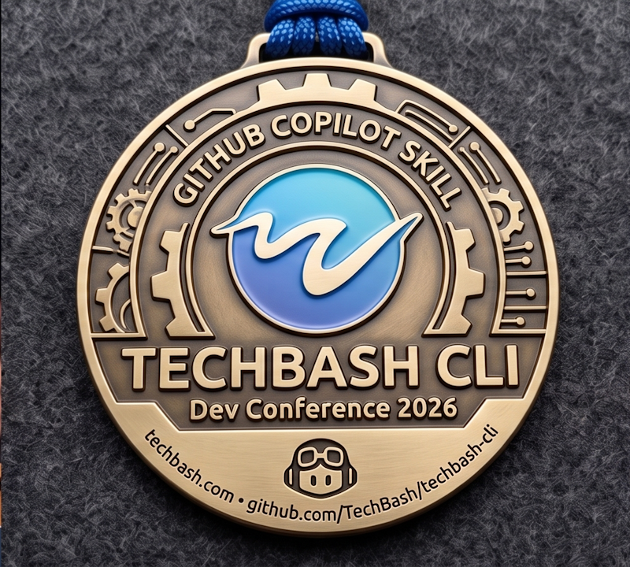

# TechBash CLI

[](https://github.com/TechBash/techbash-cli/actions/workflows/ci.yml)

A [GitHub Copilot CLI](https://github.com/features/copilot/cli/) skill that connects your local project to the **TechBash 2026** session catalog. Find sessions relevant to your stack, look up speakers, plan your schedule, and capture notes — all from your terminal.

> **TechBash 2026** — Oct 13–16, 2026 · Kalahari Resort & Convention Center, Pocono Manor, PA · <https://techbash.com>

## Quick Start

1. Open **GitHub Copilot CLI** in any project and run:

   ```
   /plugin install techbash/techbash-cli
   ```

2. Restart your Copilot CLI session:

   ```
   /restart
   ```

3. Try:

   ```
   What TechBash sessions are relevant to my project?
   ```

The skill reads `package.json`, `requirements.txt`, `*.csproj`, `go.mod`, and other dependency files, maps them to topics, and searches the live TechBash 2026 catalog hosted on Sessionize.



## What You Can Do

### Before TechBash — plan your trip

| Ask the skill to… | Example |
| --- | --- |
| Find sessions for your project | *"What TechBash sessions should I attend?"* |
| Filter by topic | *"Show me the .NET / DevOps / soft-skills sessions."* |
| Look up a speaker | *"Tell me about Mitchel Sellers."* |
| Browse workshops | *"What's on the workshop day?"* |
| Plan for the family | *"What's happening on Family Day?"* |
| Get venue info | *"How do I get to Kalahari from EWR?"* |

### During TechBash — capture what matters

| Ask the skill to… | Example |
| --- | --- |
| See what's on now | *"What's happening right now?"* |
| Find the next thing in a room | *"What's next in the main hall?"* |
| Log a note | *"Log a note from 'Restoring Lost Work in Git': great demo of reflog."* |

> The schedule (Sessionize `GridSmart`) is populated closer to the event. Until then, the skill returns sessions without time/room data and tells you so.

### After TechBash — ship what you learned

| Ask the skill to… | Example |
| --- | --- |
| Summarize your notes | *"Summarize my TechBash notes."* |
| Draft a trip report | *"Write a blog post about my TechBash takeaways."* |
| Scaffold a starter | *"Scaffold a project based on the .NET Aspire session."* |

## How It Works

The skill is a thin layer over the **live TechBash 2026 catalog** hosted on Sessionize:

| Source | Used for |
| --- | --- |
| `https://sessionize.com/api/v2/hppwa4hg/view/Sessions` | Session list |
| `https://sessionize.com/api/v2/hppwa4hg/view/Speakers` | Speakers + bios + links |
| `https://sessionize.com/api/v2/hppwa4hg/view/SpeakerWall` | Speaker headshots |
| `https://sessionize.com/api/v2/hppwa4hg/view/GridSmart` | Schedule grid (when published) |
| `https://sessionize.com/api/v2/hppwa4hg/view/All` | One-shot fetch of everything |

No API keys required. Data is fetched live; the agent should cache responses for the lifetime of a single conversation.

> Future work: Zoho Backstage integration for **sponsors** and **ticketing**, plus an `@techbash/events-cli` Node helper for faster local search and caching (matches the Build-CLI architecture).

## Supported Clients

| Client | Configuration |
| --- | --- |
| GitHub Copilot CLI | `/plugin install techbash/techbash-cli` then `/restart` |
| Claude Code | `/plugin marketplace add techbash/techbash-cli` then `/plugin install techbash@techbash-marketplace` |

## Scope and Limitations

- **Event-scoped:** Targets TechBash 2026.
- **Schedule-dependent:** Time/room data appears only after the organizers publish the GridSmart schedule.
- **Not offline:** Requires network access to query the Sessionize catalog.
- **Not a replacement for the event app** — a developer-first complement.

## Documentation

Full docs live in [`docs/`](./docs/README.md):

- [Installation](./docs/installation.md) — Copilot CLI, Claude Code, manual install
- [Getting started](./docs/getting-started.md) — your first 5 minutes
- [Workflow recipes](./docs/workflows.md) — every supported workflow in detail
- [Notes & trip reports](./docs/notes-and-trip-reports.md) — capture and synthesize what you learned
- [Event reference](./docs/event.md) — dates, venue, tracks, travel
- [FAQ](./docs/faq.md) — privacy, troubleshooting, limitations
- [Zoho setup](./docs/zoho-setup.md) — maintainers: refresh sponsor + ticket snapshots

## Contributing

Issues and PRs welcome. See [`AGENTS.md`](./AGENTS.md) for repo structure and contribution conventions.

## License

[MIT](./LICENSE)
